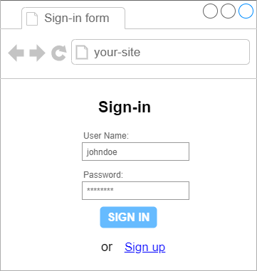
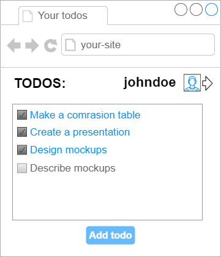

Task 5 Use-cases
======

1) For now you have views (mockups) and data structure (ER-model). You need to design [API](https://en.wikipedia.org/wiki/API)-functions that will connect your views and your data. 

    Describe at least 10 API-functions:
    - name of function
    - input parameters
    - output data

    Your API should contain functions to get and to update data of your system

    **NOTE:** you NO NEED to implement them

2) Create and describe 5-7 use-cases of your project:
 - Give a name to use-case
 - Write a script how users interact with your application and what he/she get
 
 Create [use-case diagram](https://en.wikipedia.org/wiki/Use_case_diagram), that includes all your use-cases
 
 Example of API:
 --------------
 
 For the following form:
 
 
 
 You need API-method:
 ```
 Method `signIn`
 ==============
 Input: 
 ------
 {
   username: string,
   password: string
 }
 Output:
 -------
 {
   userId: integer
   token: string
 }
 or when error:
 {
   error: string
 }
 ```
 
 For the following form: 
 
 
 
 You need API-method:
 ```
 Method `getTodoList`
 ===================
 Input: 
 ------
 {
   token: string,   // token got from `signIn` method
 }
 Output:
 -------
 {
   list: [
     { text: string, finished: boolean },
     ...
   ]
 }
 or when error:
 {
   error: string
 }
 ```
 
 Example of use case:
 --------------
 Use case 'Successful signining in'
 
 Script:
 ```
 1) User opens page "<main page url>"
 2) Main page is displayed to user
 3) User clicks button "SIGN IN"
 4) Sign in form is displayed to user
 5) User enters correct value in `username` field
 6) Entered value is displayed in field `username`
 7) User enters correct value in `password` field
 8) Entered value, which is masked with * , is displayed in field `password`
 9) User click button "SIGN IN"
 10) Form become blocked
 11) Application send request to api method 'signIn'
 12) Once result of request was got, application opens page "Todos list"
 ```
 
 **Note:** each action of user leads to some answer of application
    
 
 
